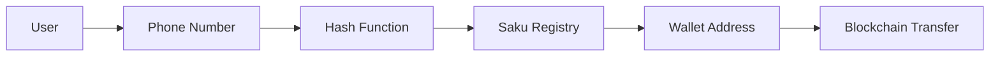

<div align="center">

  

  # Saku

  **Simplify crypto transfers with phone numbers — no complex wallet addresses needed**

  [](https://nextjs.org/)
  [](https://www.typescriptlang.org/)
  [](https://docs.ethers.org/)
  [](LICENSE)

  [Features](#-features) • [Quick Start](#-quick-start) • [Architecture](#-architecture) • [Tech Stack](#-tech-stack) • [Contributing](#-contributing)

</div>

---

## ✨ Features

### 🚀 Core Functionality
- **Phone-Based Transfers** — Send crypto using phone numbers instead of wallet addresses
- **Easy Top-Up** — Add funds via traditional payment gateways (Midtrans)
- **Split Bills** — Divide payments effortlessly among multiple recipients
- **QR Payments** — Generate and claim QR codes for quick transactions
- **Wallet Management** — Complete control over deposits, transfers, and withdrawals
- **Transaction History** — Track all your crypto activities in one place

### 🔐 Security & Integration
- **Smart Contract Integration** — Interacts with Saku Registry on Arbitrum Sepolia
- **JWT Authentication** — Secure OTP-based verification system
- **Supabase Backend** — Real-time database with Row Level Security
- **Encrypted Data** — End-to-end encryption for sensitive information

### 💎 User Experience
- **Mobile-First Design** — Optimized for on-the-go transactions
- **Real-Time Updates** — Instant balance and transaction updates
- **Intuitive Navigation** — Seamless flow between wallet functions
- **Dark Mode Support** — Easy on the eyes, day or night

---

## 🚀 Quick Start

### Prerequisites

- Node.js 18+ and pnpm
- A Supabase project
- Arbitrum Sepolia RPC endpoint
- Midtrans API keys (for payment gateway)

### Installation

```bash
# Clone the repository
git clone https://github.com/yourusername/saku.git
cd saku

# Install dependencies
pnpm install

# Configure environment variables
cp .env.local.example .env
# Edit .env with your configuration

# Run development server
pnpm dev
```

Open [http://localhost:3000](http://localhost:3000) to view the application.

### Environment Variables

```bash
# Supabase Configuration
NEXT_PUBLIC_SUPABASE_URL=your_supabase_url
NEXT_PUBLIC_SUPABASE_ANON_KEY=your_supabase_anon_key

# Blockchain Configuration
NEXT_PUBLIC_RPC_URL=https://sepolia-rollup.arbitrum.io/rpc
NEXT_PUBLIC_SAKU_REGISTRY_ADDRESS=0xFf3157D1BE69e88F40eb105d222344b10Caa25A1
NEXT_PUBLIC_IDRX_ADDRESS=your_idrx_token_address
ADMIN_PRIVATE_KEY=your_admin_private_key

# Payment Gateway (Midtrans)
NEXT_PUBLIC_MIDTRANS_CLIENT_KEY=your_client_key
MIDTRANS_SERVER_KEY=your_server_key
```

---

## 🏗 Architecture

### Project Structure

```
saku/
├── app/
│   ├── api/              # API routes (auth, transfers, payments)
│   ├── home/             # Main dashboard
│   ├── topup/            # Payment gateway integration
│   ├── transfer/         # Send crypto
│   ├── split-bill/       # Bill splitting
│   ├── withdraw/         # Cash out
│   └── transactions/     # Transaction history
├── components/           # Reusable UI components
├── lib/
│   ├── config.ts         # Network & contract config
│   ├── supabase/         # Database client
│   └── utils/            # Helper functions
└── contracts/            # Smart contract artifacts
```

### Key Components

| Component | Description |
|-----------|-------------|
| **SakuRegistry** | Maps phone numbers to wallet addresses on-chain |
| **Payment Gateway** | Midtrans integration for fiat on-ramp |
| **Wallet SDK** | Ethers.js for blockchain interactions |
| **Auth System** | JWT + OTP verification via WhatsApp |

### Data Flow



---

## 🛠 Tech Stack

### Frontend
| Technology | Purpose |
|------------|---------|
| [Next.js 16](https://nextjs.org) | React framework with App Router |
| [TypeScript](https://www.typescriptlang.org) | Type-safe JavaScript |
| [Tailwind CSS](https://tailwindcss.com) | Utility-first styling |
| [Radix UI](https://www.radix-ui.com) | Accessible component primitives |
| [Lucide Icons](https://lucide.dev) | Beautiful icon set |

### Backend & Database
| Technology | Purpose |
|------------|---------|
| [Supabase](https://supabase.com) | PostgreSQL database & auth |
| [Next.js API Routes](https://nextjs.org/docs/api-routes/introduction) | Serverless endpoints |
| [Firebase Admin](https://firebase.google.com/docs/admin) | Push notifications |

### Blockchain & Payments
| Technology | Purpose |
|------------|---------|
| [Ethers.js v6](https://docs.ethers.org) | Web3 interactions |
| [Arbitrum Sepolia](https://sepolia.arbitrum.io) | Testnet deployment |
| [Midtrans](https://midtrans.com) | Payment gateway |
| [QRCode.react](https://github.com/zpao/qrcode.react) | QR code generation |

### Additional Tools
- [Farcaster Mini-App SDK](https://github.com/farcasterxyz/minikit) — Social integration
- [Recharts](https://recharts.org) — Data visualization
- [AOS](https://michalsnik.github.io/aos) — Scroll animations
- [Zod](https://zod.dev) — Schema validation

---

## 📱 App Routes

| Route | Description |
|-------|-------------|
| `/` | Landing page |
| `/get-started` | Onboarding flow |
| `/home` | Main dashboard |
| `/topup` | Add funds via payment gateway |
| `/transfer` | Send to phone number or address |
| `/pay` | Payment interface |
| `/split-bill` | Split payments with others |
| `/withdraw` | Cash out to bank account |
| `/transactions` | Transaction history |
| `/profile` | User settings |

---

## 🔧 Configuration

### Network Settings

Default network is **Arbitrum Sepolia** (Chain ID: 421614). Configure in `lib/config.ts`:

```typescript
export const NETWORK_CONFIG = {
  chainId: 421614,
  name: "Arbitrum Sepolia",
  rpcUrl: "https://sepolia-rollup.arbitrum.io/rpc",
  blockExplorer: "https://sepolia.arbiscan.io",
};
```

### Smart Contract

**SakuRegistry** deployed at: `0xeB94353ccdD59f49126205903B7Fb7A91CBD3226`

```solidity
// contracts/saku.sol
contract SakuRegistry {
  mapping(address => string) public addressToPhone;
  mapping(string => address) public phoneToAddress;
}
```

---

## 🤝 Contributing

We welcome contributions! Please see our [Contributing Guide](CONTRIBUTING.md) for details.

1. Fork the repository
2. Create your feature branch (`git checkout -b feature/amazing-feature`)
3. Commit your changes (`git commit -m 'Add amazing feature'`)
4. Push to the branch (`git push origin feature/amazing-feature`)
5. Open a Pull Request

---

## 📄 License

This project is licensed under the MIT License — see the [LICENSE](LICENSE) file for details.

---

## 🙏 Acknowledgments

- Built with [Next.js](https://nextjs.org)
- Smart contracts deployed on [Arbitrum](https://arbitrum.io)
- UI components from [Radix UI](https://www.radix-ui.com)
- Icons by [Lucide](https://lucide.dev)

---

<div align="center">

  **Made with ❤️ by the Saku team**

  [](https://github.com/yourusername/saku)
  [](https://github.com/yourusername/saku/fork)

  **[Documentation](https://github.com/yourusername/saku/wiki)** • **[Report Bug](https://github.com/yourusername/saku/issues)** • **[Request Feature](https://github.com/yourusername/saku/issues)**

</div>
